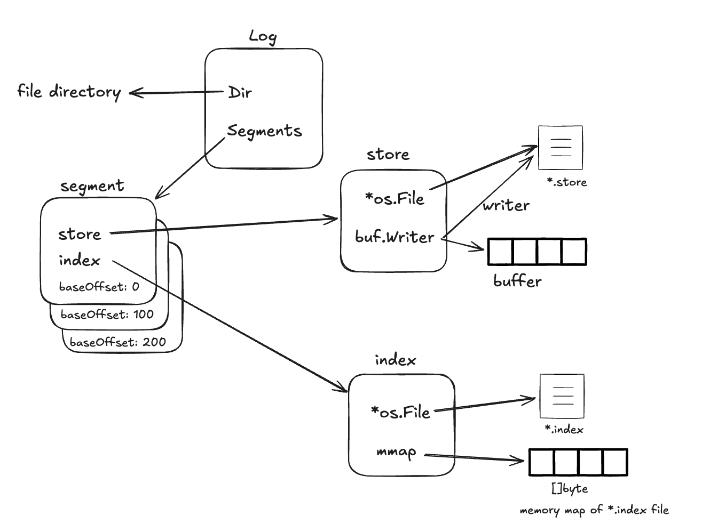

Protobuf

```sh
$ go install google.golang.org/protobuf/cmd/protoc-gen-go@v1.36.8
```

## Segment

Each segment comprises a store file and an index file.

- The segments's store file is where we store the record data; we continually append records to this file.
- The second's index file is where we index each record in the store file. The index file speeds up reads because it maps record offsets to their position in the store file.

Reading a record given its offset is a two-step process:

1. first you get the entry from the index file for record, which tells you the position of the record in the store file,
2. and then you read the record at that position in the store file. Since the index file requires only two small fields - the offset and the stored position of the record - the index file is much smaller than the store file.

> Index files are small enough that we can memory-map them and make operations on the file as fast as operating on in-memory data.

## Terms

- `Record` - the data stored in our log.
- `Store` - the file we store records in.
- `Index` - the file we store index entries in.
- `Segment` - the abstration that ties a store and an index together.
- `Log` - the abstration that ties all the segments together.

# Index

```
[offset1][position1][offset2][position2][offset3][position3]...
 4bytes   8bytes     4bytes   8bytes     4bytes   8bytes
```

# Segment Offset vs Index Offset

```
全局日志空间:
[0, 1, 2, ..., 999]   [1000, 1001, 1002, 1003, 1004] [2000, 2001, ...]
 Seg0 (baseOffset=0)   Seg1 (baseOffset=1000)        Seg2 (baseOffset=2000)
                            nextOffset=1005

Seg1的索引:
index offset: 0    1    2    3    4
对应全局:     1000 1001 1002 1003 1004
```

### Conversion

```
// 全局偏移量 → 相对偏移量 (用于索引查找)
relativeOffset = globalOffset - baseOffset

// 相对偏移量 → 全局偏移量 (用于记录定位)
globalOffset = baseOffset + relativeOffset
```

### Design


